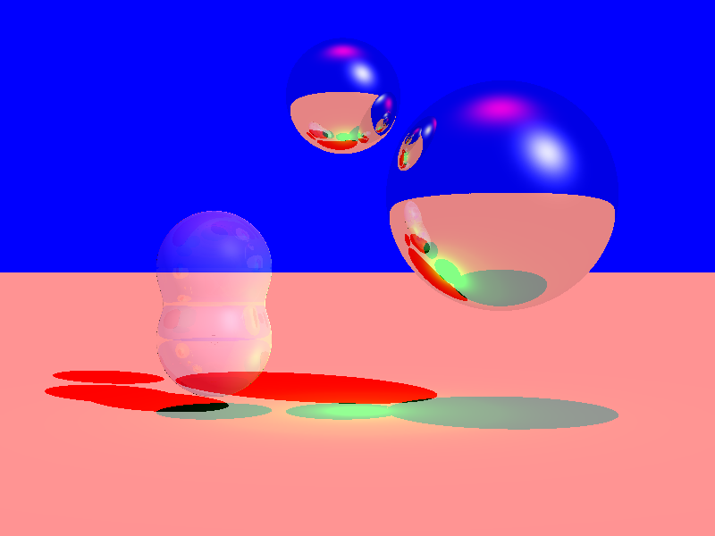
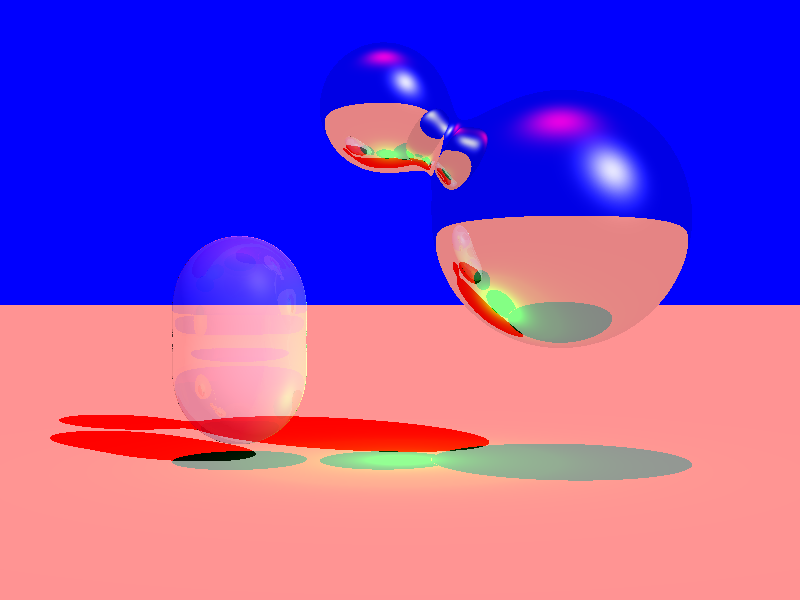
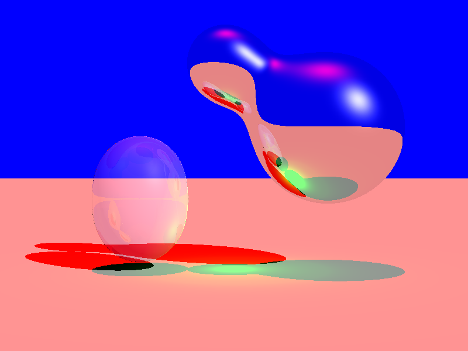

* TOC
{:toc}

# Animations
Each animation executable first uses the raytracer to render all frames, then prints the relevant ffmpeg command to stitch them together into a video.

## SDF Union Examples
<video src="outdoor_new4.mp4" controls style="width: 90%;"></video>
Created with `outdoor_animate.exe`.

<video src="bounce_union_old.mp4" controls style="width: 90%;"></video>
Created with `bounce_union_old.exe`. Uses the old version of `sdf_union`, which interpolated the color of a hitpoint based on its distance to each of the objects. This caused errors with refraction and tori, so it is currently commented out in the file.

## SDF Morph Examples
<video src="torus_morph_new.mp4" controls style="width: 90%;"></video>
Created with `torus_morph.exe`.

<video src="torus_box.mp4" controls style="width: 90%;"></video>
Created with `torus_box.exe`.

# Static images
Static images are created from scene files using the raytracer, which can be found in the example scenes folder in the project folder.

## Varying blend factor in smooth union
<figure>
  <table>
    <tr>
      <td></td>
      <td></td>
      <td></td>
      <td></td>
    </tr>
    <tr>
      <td>k=0.1
      <td>k=2
      <td>k=5
      <td>k=10
    </tr>
  </table>
    <figcaption>
      This sequence of images is generated from almost identical scene files which can be found <a href="https://github.com/mandywyllie/CSCI5607Project5/blob/main/ExampleScenes/varyingK">here</a>. Only the blend factor changes from left to right.
    </figcaption>
</figure>

## Varying time in morph

# Scenefile commands and usage
The raytracer works by reading a plaintext scenefile. Instructions for creating the the scenefile are [here](https://github.io){:target="_blank"}. The SDF ray tracer supports all those original commands, and implements these new commands:

| Function | Parameters | Description |
| :--- | :--- | :--- |
| `sdf_sphere` | `x y z r` | `(x,y,z)` is the position of the sphere's center, `r` is the radius of the sphere. |
| `sdf_box` | `x, y, z, hx, hy, hz, dx, dy, dz` | `(x,y,z)` is the position of the box's center, `hx,hy, hz` are the half lengths of the box's sides, and `(dx,dy,dz)` is the direction the top of the box will face. |
| `sdf_torus` | `x, y, z, r1, r2, dx, dy, dz` | `(x,y,z)` is the position of the torus' center, `r1` is the radius controling the size of the ring, `r2` is the radius controling the thickness of the ring, and `(dx,dy,dz)` is the direction the top of the torus will face. |
| `sdf_union` | `k` | Creates a smooth union between objects A and B with a blend factor of `k`, of the same material as object A. Requires two sdf objects to be created before the union command. The default is `k=0.3`. Values close to 0 result in no smoothing between objects, i.e. a hard union, while higher values of k creates more blending between objects.|
| `sdf_morph` | `t` | Creates an "in-between" object at time `t` in morphing from object A to object B, and interpolates the material between object A and object B depending on the time. Requires two sdf objects to be created before the morph command. Displays object A at `t=0`, and object B at `t=1`. `t` should optimally be between 0 and 1, however other values will still render and creates some fun images! |

[//]: # (TODO add example usage here)

# Compiling and running the raytracer
  
  1. To Compile
    With Checks for memory issues: 
        `g++ -fsanitize=address -std=c++11 rayTracer.cpp`
    Without Checks for memory issues:
        `g++ -std=c++11 rayTracer.cpp`

1. to take in a scene file and output an image:
   `.\ray.exe *path to scenefile* `   
   Ex: `.\ray.exe .\ExampleScenes\sdf_box.txt `

# Project Files
You can view the files on github <a href="https://github.com/mandywyllie/CSCI5607Project5/">here</a>, or download the project zip <a href="https://github.com/mandywyllie/CSCI5607Project5/blob/main/CSCI5607project5.zip">here</a>.

